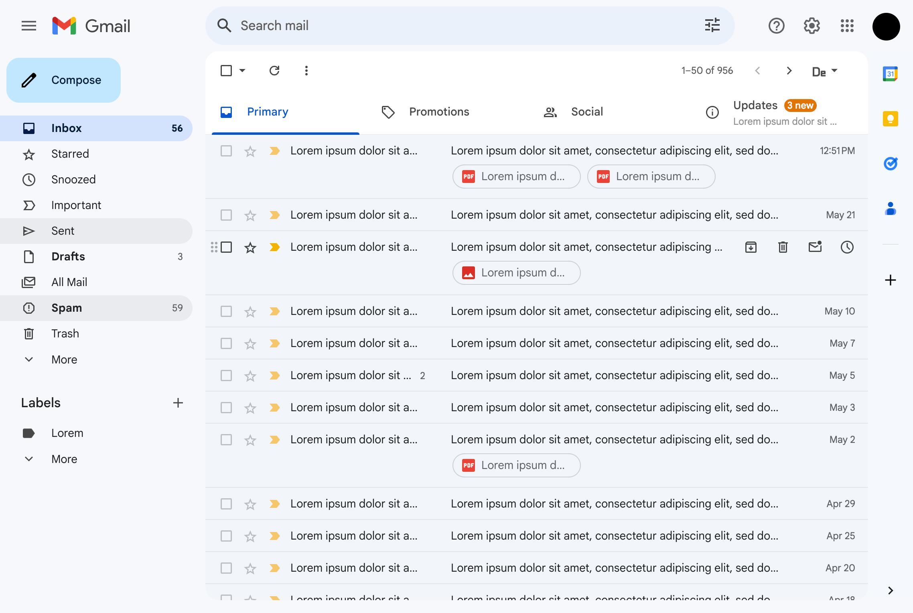
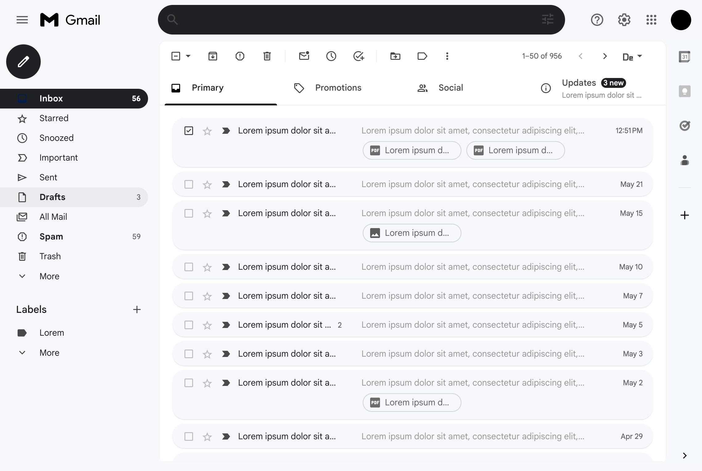

# Monochrome Theme for Gmail
This Chrome extension provides Gmail with a sleek, modern, and minimalistic monochrome theme, enhancing your email experience without any distractions. 

## 📸 Screenshots

  

  
  

Before
  

    

  
    
After
  

## ✨ Features
- 🎨 Minimalistic and modern monochrome theme for Gmail.
- 🖤 Focus on content without colorful distractions. 
- 🔄 Seamless integration with Gmail's existing interface. 
- 🚀 Lightweight and efficient, ensuring a smooth performance. 
  
## 🚀 Getting Started 
1. Clone the extension or download the latest release. 
2. Open the Chrome browser and navigate to [chrome://extensions](chrome://extensions). 
3. Enable the developer mode by clicking the toggle switch in the top right corner of the page. 
4. Click on the "Load unpacked" button and select the cloned extension folder. 
5. The extension should now be installed and ready to use. The extension will automatically apply the monochrome theme whenever you open Gmail in your browser. 
   
## 📮 Support 
For any issues, questions, or suggestions, please feel free to open a new issue in the repository. I welcome all feedback and contributions!
 
 ## 🤝 Contributing 
 1. Fork the repository. 
2. Create your feature branch (`git checkout -b feature/AmazingFeature`). 
3. Commit your changes (`git commit -m 'Add some AmazingFeature'`). 
4. Push to the branch (`git push origin feature/AmazingFeature`). 
5. Open a pull request. 
   
## 📢 Note
For the best look and experience, make sure to use the default theme in the gmail settings and disable any other Gmail extensions that might interfere with this extension.